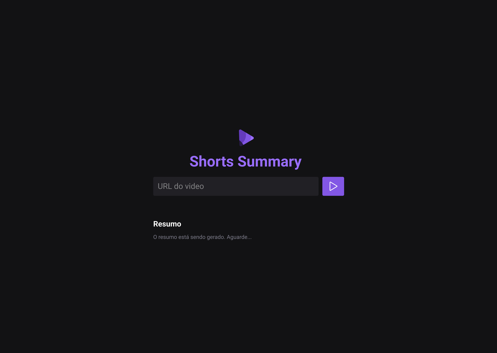

<h1 align="center"> Transcrição de shorts com IA </h1>


Desafio feito junto com a Rockseat
<br>

<br>

<h3 id="tecnologias"> Tecnologias Utilizadas</h3>

<div style="display: inline_block">
    
    
    
</div>

<br>


## Rodando localmente

Clone o projeto

```bash
  git clone https://github.com/raynnenogueira/nlwia
```

Entre no diretório do projeto

```bash
  cd my-project
```

Instale as dependências

```bash
  npm install
```

Inicie o servidor

```bash
  npm run web
  npm run server
```

<br>

<p text-align="center">
  
</p>


